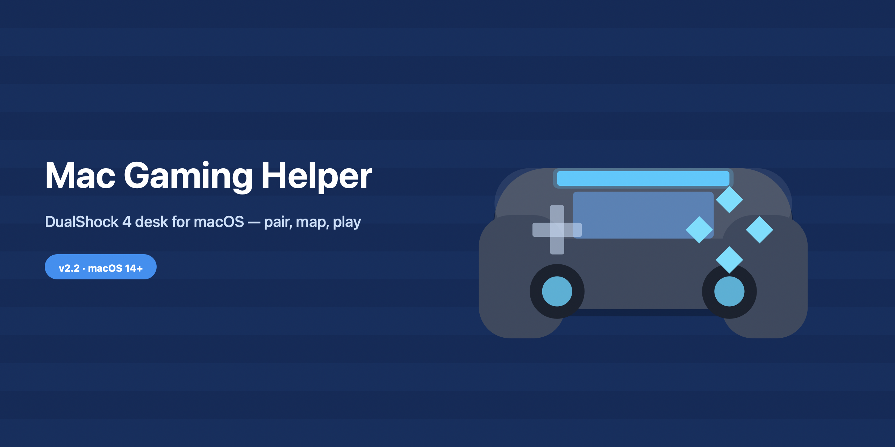
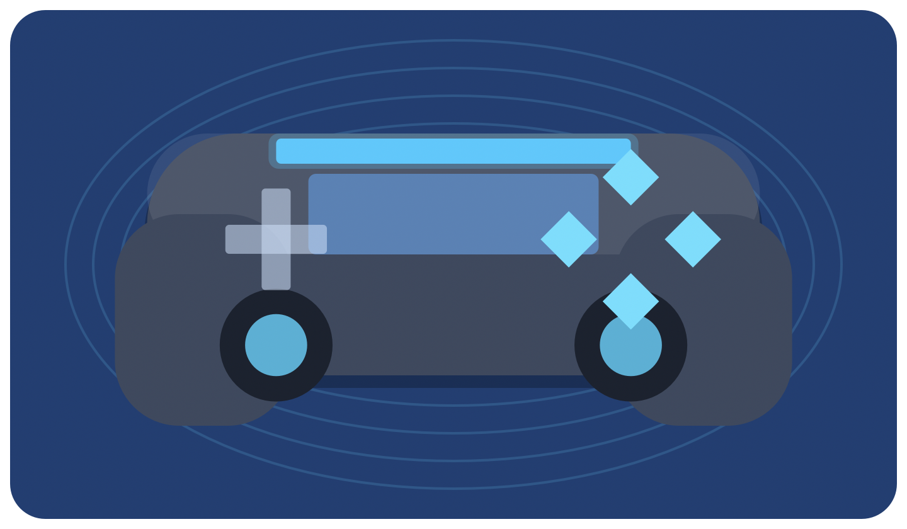
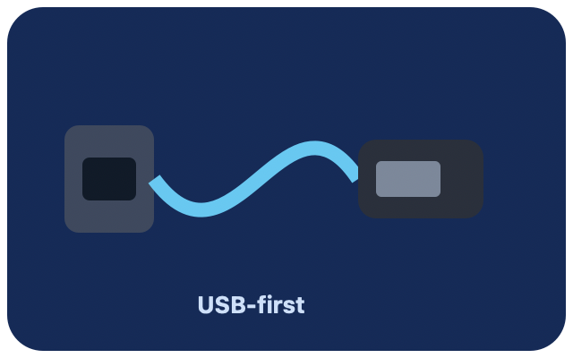
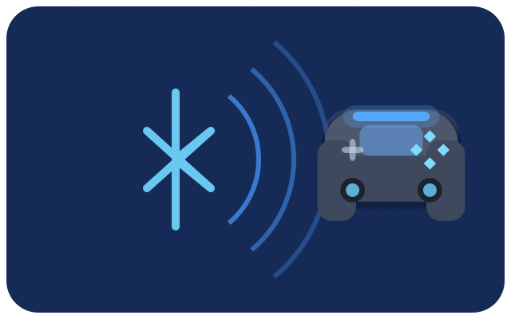

# Mac Gaming Helper

Native SwiftUI macOS app for playing with a **PlayStation DualShock 4** on Apple silicon Macs (macOS 14+).



Live controller desk (Game Controller / `GCController`), DualShock-style layout, light bar & haptics when available, optional keyboard/mouse mapping, and a **Pairing / Setup** coach with illustrated USB-first rescue steps for the common “lights flash but Bluetooth never lists the pad” failure.



## Relation to Game Bay

This project **continues and improves** the local predecessor Game Bay (`~/Projects/game-bay` when present).

- Game Bay is **not deleted**. Keep using it for Coach / library features if you like.
- Mac Gaming Helper keeps the launcher hub (Steam, Heroic, GeForce NOW) and replaces the thin controller page with a DualShock 4–first desk: multi-pad selection, live diagram, stylized pad art, light bar, haptics test, pairing coach, and optional keyboard/mouse mapping.

## Gaming (3.2)

- **Input Test** tab to verify every DualShock control before a match
- Keep display awake during Play HUD / gaming session
- Steam favourites + filter; Heroic library when present
- Connect/disconnect audio cues; combo macro (hold L1 + tap face button)

## Gaming (3.1)

- Open the **Play** tab for Session Prep and Steam quick-launch.
- **Prep Steam session** turns Mapping off and opens Big Picture (Steam Input owns the DualShock 4).
- Optional **Play HUD** stays on top while in a game (Settings or menu bar).
- Mapping aim: response curves + aim sensitivity; hair-trigger L2/R2; ⌥⌘M pause; ⌘⌥1–3 profiles.

## Features

- Apple **Game Controller** — DualShock 4 (`GCDualShockGamepad`), DualSense, and other extended pads
- Connect / disconnect notifications + **Rediscover** wireless scan
- Live button / stick / trigger readouts and a schematic DualShock layout
- Stylized **bundled artwork** (hero pad, pairing coach steps, mapping / launcher badges) — not SF Symbols only
- Battery, light-bar tint (when exposed), haptic pulse
- **Pairing / Setup** coach: Bluetooth Share+PS, **USB-first** rescue, reset pinhole, Steam Big Picture vs Mapping, permissions
- Optional **keyboard / mouse mapping** profiles (FPS WASD, Arrows) for non-gamepad titles
- **v3:** sidebar sections, LIVE mapping pause (⌥⌘M), diagnostics export, motion honesty, Steam Big Picture safety
- **Menu bar** status, Settings (login item, deadzones, updates), custom mapping profiles, low-battery alerts
- Offline self-test: `MacGamingHelper --self-test`
- Offline — no accounts required for controller status or mapping

### Pairing illustrations

| USB-first | Bluetooth |
|---|---|
|  |  |

## Requirements

- macOS 14 or later (Apple silicon recommended)
- Xcode Command Line Tools (`xcode-select --install`) so `swiftc` and a macOS SDK are available

## Clone / build / install

```bash
git clone https://github.com/ZeroXSHDW/MacGamingHelper.git
cd MacGamingHelper
./scripts/install.sh
```

Installs to `~/Applications/Mac Gaming Helper.app` and adds a Desktop symlink. Game Bay is left untouched.

Build only (into `dist/`):

```bash
./scripts/build.sh
```

`build.sh` regenerates stylized PNGs into `Resources/`, copies them into the `.app` bundle, builds the icon, and compiles Sources.

Self-test after install:

```bash
./scripts/self-test.sh
# or:
"$HOME/Applications/Mac Gaming Helper.app/Contents/MacOS/MacGamingHelper" --self-test
```

## Pair a DualShock 4

### Normal Bluetooth

1. Hold **Share + PlayStation** until the light bar flashes quickly.
2. System Settings → Bluetooth → **Wireless Controller** → Connect.
3. Open Mac Gaming Helper → **Rediscover** → watch the Controller page.

### USB-first (when lights flash but the pad never appears)

1. Use a Micro-USB **data** cable (not charge-only).
2. Plug into the Mac, press **PS** once, then Rediscover.
3. Optionally complete Bluetooth pairing while still on USB, then unplug.

### Reset

Flip the pad over → paperclip in the **reset pinhole** near L2 for ~5 seconds → retry USB or Share+PS.

Full steps live in the app under **Pairing / Setup**.

### Steam vs Mapping

- Steam: use **Big Picture** so Steam Input owns the pad. Keep Mapping **off**.
- Mapping: for apps that ignore gamepads. Requires **Accessibility**.

## Permissions

| Permission | When |
|---|---|
| **Bluetooth** | Pair DualShock 4 wirelessly |
| **Accessibility** | Only when Mapping is enabled (posts CGEvents). Deny safely leaves Mapping off. |
| **Input Monitoring** | Only if macOS prompts; not required for basic GCController readouts |

## Project layout

```
Resources/          # Bundled PNG art (generated by scripts/make-assets.swift)
Sources/            # SwiftUI app
scripts/build.sh    # Compile + package .app
scripts/install.sh  # Install to ~/Applications
docs/screenshots/   # README images
```

## Known limits

- **Gatekeeper / ad-hoc signature**: builds are ad-hoc signed (`codesign -s -`). First open may need Right-click → Open, or `xattr -cr` on the `.app` (install.sh already clears quarantine when possible).
- **Accessibility**: Mapping cannot post keys until you enable the app in Privacy & Security → Accessibility.
- **Bluetooth quirks**: some DualShock 4 units never show in macOS Bluetooth until USB pairing succeeds once.
- **Light bar / haptics**: depend on what Game Controller exposes for that firmware / connection mode.
- **Artwork**: stylized / abstract silhouettes — not photo-realistic trademark replicas.
- **Sandbox**: entitlements disable App Sandbox so Bluetooth + CGEvent mapping work; this is intentional for a local helper.

## Changelog

See [CHANGELOG.md](CHANGELOG.md) for 3.0.0 release notes.

## License

MIT — see [LICENSE](LICENSE).
